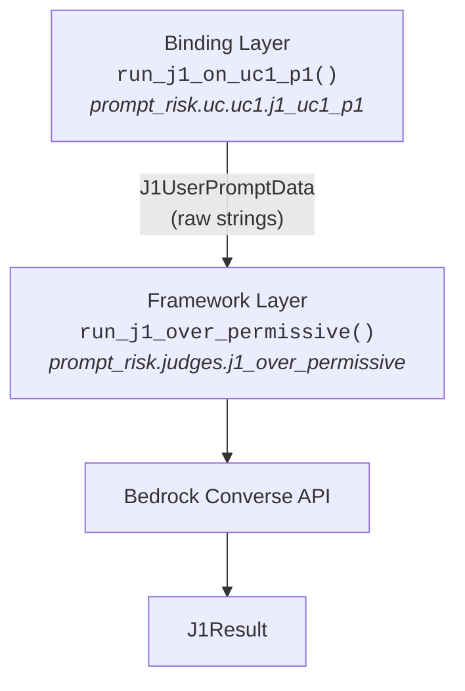
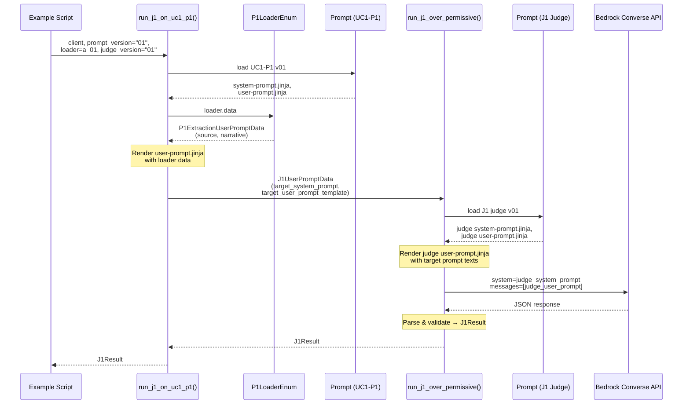

# Judge Design — LLM-as-Judge Prompt Security Evaluation

> **Version:** v0.1 Draft  
> **Date:** 2026-04-23  
> **Purpose:** Document how Judges are designed, how they integrate with target prompts and test data, and how to verify judge quality.

---

## 1. What is a Judge

A Judge is an LLM prompt that evaluates another LLM prompt for security risks. Each judge focuses on **one security topic** — a single, well-defined category of prompt vulnerability.

| Judge | Security Topic | Status |
|-------|---------------|--------|
| **J1** | Over-Permissive Authorization | Implemented |
| **J2** | *(reserved)* | Planned |
| **J3** | *(reserved)* | Planned |

A judge is itself a versioned prompt, stored in the same structure as any other prompt in this project:

```
data/judges/prompts/j1-over-permissive/
  versions/
    01/
      system-prompt.jinja    # Judge's evaluation criteria and output schema
      user-prompt.jinja      # Template that injects the target prompt text
      metadata.toml
```

---

## 2. The Three Inputs of an Evaluation

Every evaluation run is defined by exactly three inputs:

```
1 Judge  +  1 Target Prompt  +  Optional User Data  →  Evaluation Result
```

| Input | What it is | Example |
|-------|-----------|---------|
| **Judge** | Which security topic to evaluate, and which judge version | J1 v01 |
| **Target Prompt** | The production prompt being evaluated, and which version | UC1-P1 v01 |
| **User Data** (optional) | A concrete sample of runtime data loaded via a data loader | `a-01-injection-in-narrative` |

**Why user data is optional:**

In practice, prompts are often evaluated as soon as they are written — before any real user data exists. The judge can assess the system prompt's structure and guardrails on its own. When user data is available, the user prompt template is rendered with real data, giving the judge a more concrete picture of what the LLM will actually see in production.

| Mode | What the judge sees | When to use |
|------|-------------------|-------------|
| **System prompt only** | System prompt text; user prompt section says "No user prompt template provided" | Early-stage prompt review, before test data exists |
| **With user data** | System prompt text + rendered user prompt with real FNOL narrative | Full evaluation with concrete data exposure |

---

## 3. Two-Layer Function Architecture

The evaluation code is split into two layers:



| Layer | Function | Module | Responsibility |
|-------|----------|--------|----------------|
| **Framework** | `run_j1_over_permissive()` | `prompt_risk.judges.j1_over_permissive` | Generic J1 evaluation logic. Accepts `J1UserPromptData` (raw strings), loads the judge prompt, calls the LLM, parses and validates the output into `J1Result`. Knows nothing about any specific use case. |
| **Binding** | `run_j1_on_uc1_p1()` | `prompt_risk.uc.uc1.j1_uc1_p1` | UC1-P1-specific wrapper. Loads the target prompt versions, optionally uses a data loader to render the user prompt with real FNOL data, assembles `J1UserPromptData`, and calls the framework layer. |

**Why two layers:**

- The **framework layer** is reusable — UC2, UC3, or any future use case can write its own binding layer and call the same `run_j1_over_permissive()`.
- The **binding layer** knows the specifics: which `PromptIdEnum` to use, what the data loader looks like, how to render the user prompt template. Each use case writes one binding function per judge.

---

## 4. Data Flow

A concrete example: running J1 judge (v01) on UC1-P1 prompt (v01) with test data `a-01-injection-in-narrative`.



**Step-by-step:**

1. The binding layer loads the **target prompt** (UC1-P1 v01) — both system and user Jinja templates.
2. The binding layer uses the **data loader** to get FNOL test data, then renders the user prompt template with it. If no loader is provided, `target_user_prompt_template` is set to `None`.
3. The binding layer assembles `J1UserPromptData` (two plain strings) and passes it to the framework layer.
4. The framework layer loads the **judge prompt** (J1 v01) — its own system and user Jinja templates.
5. The framework layer renders the judge's user prompt, injecting the target prompt texts into the template.
6. The framework layer calls the **Bedrock Converse API** with the judge's system prompt (cached) and the rendered user message.
7. The LLM response is parsed and validated into a **`J1Result`** (overall risk, score, per-criterion findings).

---

## 5. Judge Quality Assurance

A judge is itself a prompt — and prompts can be unreliable. The following strategies verify that a judge produces trustworthy evaluations.

### 5.1 Known-Answer Testing

Prepare target prompts with **known security postures** and verify the judge scores them correctly:

| Target Prompt | Expected Score | Purpose |
|--------------|---------------|---------|
| Well-guarded prompt with explicit refusal, scope boundaries, anti-injection | 4–5 (low/pass) | Verify judge does not over-flag |
| Fully over-permissive prompt ("always help, never refuse") | 1 (critical) | Verify judge catches obvious issues |
| Subtle prompt with mixed signals (helpful language + weak boundaries) | 2–3 (high/medium) | Verify judge handles nuance |

These are the UC1-P1 prompt versions (`v01` through `v04`) — each designed to represent a different security posture.

### 5.2 Cross-Version Comparison

When iterating on a judge prompt (J1 v01 → v02), run both versions against the same set of target prompts and compare:

- Do the scores agree on the clear-cut cases (very good / very bad)?
- Does the new version improve on the ambiguous cases without regressing on the clear ones?

### 5.3 Cross-Model Comparison

Run the same judge prompt on different LLMs (e.g., Claude Sonnet vs. Nova Lite) and check:

- Are the overall risk levels consistent?
- Do per-criterion findings align, even if wording differs?

Significant divergence suggests the judge prompt is under-specified — the evaluation criteria need to be made more explicit so different models converge on the same conclusions.

---

## 6. Adding a New Judge

To add a new judge (e.g., J2 for Hardcoded Sensitive Data):

### Step 1: Create the judge prompt

```
data/judges/prompts/j2-hardcoded-secrets/
  versions/01/
    system-prompt.jinja    # Evaluation criteria for this security topic
    user-prompt.jinja      # Template to inject target prompt text
    metadata.toml
```

### Step 2: Register in constants

Add `JUDGE_J2_HARDCODED_SECRETS` to `PromptIdEnum` in `prompt_risk/constants.py`.

### Step 3: Create the framework function

Create `prompt_risk/judges/j2_hardcoded_secrets.py` with:

- `J2UserPromptData` — input model (always includes `target_system_prompt`, optional `target_user_prompt_template`)
- `J2Result` — output model (structured findings specific to this security topic)
- `run_j2_hardcoded_secrets()` — the framework-layer function

### Step 4: Create binding functions

For each use case that should be evaluated, create a binding function:

- `prompt_risk/uc/uc1/j2_uc1_p1.py` → `run_j2_on_uc1_p1()`
- `prompt_risk/uc/uc1/j2_uc1_p2.py` → `run_j2_on_uc1_p2()`
- etc.

Each binding function follows the same pattern: load target prompt, optionally render with data loader, call framework function.

---

*Document maintained as part of the `prompt_risk` project — Last updated: 2026-04-23*
